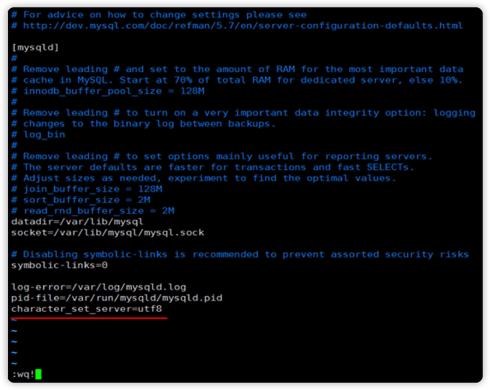

### 第01章 Linux下MySQL的安装与使用

#### **1.安装前说明**
- 安装有 Xshell 和 Xftp 等访问CentOS系统的工具
- CentOS6和CentOS7在MySQL的使用中的区别

```shell
1. 防火墙：6是iptables，7是firewalld 
2. 启动服务的命令：6是service，7是systemctl
```

##### **1.1查看是否安装过MySQL**

- 如果你是用rpm安装, 检查一下RPM PACKAGE：

```shell
rpm -qa | grep -i mysql # -i 忽略大小写
```

- 检查mysql service：

```shell
systemctl status mysqld.service
```

##### **1.2 MySQL的卸载**

**1.关闭mysql服务**

```shell
systemctl stop mysqld.service
```

**2.查看当前mysql安装状况**

```shell
rpm -qa | grep -i mysql
# 或
yum list installed | grep mysql
```

**3.卸载上述命令查询出的已安装程序**

```shell
yum remove mysql-xxx mysql-xxx mysql-xxx mysqk-xxxx
```

务必卸载干净，反复执行`rpm -qa | grep -i mysql`确认是否有卸载残留

**4.删除mysql相关文件**

- 查找相关文件

```shell
find / -name mysql
```

- 删除上述命令查找出的相关文件

```shell
rm -rf xxx
```

**5.删除 my.cnf**

```shell
rm -rf /etc/my.cnf
```

#### **2. MySQL的Linux版安装**

##### **2.1 MySQL的4大版本**
> - MySQL Community Server 社区版本，开源免费，自由下载，但不提供官方技术支持，适用于大多数普通用户。
> - MySQL Enterprise Edition 企业版本，需付费，不能在线下载，可以试用30天。提供了更多的功能和更完备的技术支持，更适合于对数据库的功能和可靠性要求较高的企业客户。
> - MySQL Cluster 集群版，开源免费。用于架设集群服务器，可将几个MySQL Server封装成一个Server。需要在社区版或企业版的基础上使用。
> - MySQL Cluster CGE 高级集群版，需付费。

**2.2 下载MySQL指定版本**
1. 下载地址
官网：[https://www.mysql.com](https://www.mysql.com)
2. 打开官网，点击DOWNLOADS
3. 点击 MySQL Community Server
4. 在General Availability(GA) Releases中选择适合的版本
5. Linux系统下安装MySQL的几种方式
方式1：rpm命令
  使用rpm命令安装扩展名为".rpm"的软件包。

方式2：yum命令
  需联网，从 互联网获取 的yum源，直接使用yum命令安装。

方式3：编译安装源码包
  针对 tar.gz 这样的压缩格式，要用tar命令来解压；如果是其它压缩格式，就使用其它命令。

**2.3 CentOS7下检查MySQL依赖**
**1.检查/tmp临时目录权限（必不可少)**

由于mysql安装过程中，会通过mysql用户在/tmp目录下新建tmp_db文件，所以请给/tmp较大的权限。执行 ：

```shell
chmod -R 777 /tmp
```

**2.安装前，检查依赖**

```shell
rpm -qa|grep libaio
rpm -qa|grep net-tools
```

##### **2.2 CentOS7下MySQL安装过程** 

**1.将安装程序拷贝到/opt目录下**

在mysql的安装文件目录下执行：（必须按照顺序执行）

```shell
rpm -ivh mysql-community-common-8.0.25-1.el7.x86_64.rpm 
rpm -ivh mysql-community-client-plugins-8.0.25-1.el7.x86_64.rpm 
rpm -ivh mysql-community-libs-8.0.25-1.el7.x86_64.rpm 
rpm -ivh mysql-community-client-8.0.25-1.el7.x86_64.rpm 
rpm -ivh mysql-community-server-8.0.25-1.el7.x86_64.rpm
```

- `rpm`是Redhat Package Manage缩写，通过RPM的管理，用户可以把源代码包装成以rpm为扩展名的文件形式，易于安装。
- `-i`, --install 安装软件包
- `-v`, --verbose 提供更多的详细信息输出
- `-h`, --hash 软件包安装的时候列出哈希标记 (和 -v 一起使用效果更好)，展示进度条

> 若存在mariadb-libs问题，则执行**yum remove mysql-libs**即可

##### **2.3查看MySQL版本**

```shell
mysql --version 
#或
mysqladmin --version
```

##### **2.4服务的初始化**

为了保证数据库目录与文件的所有者为 mysql 登录用户，如果你是以 root 身份运行 mysql 服务，需要执行下面的命令初始化：

```shell
mysqld --initialize --user=mysql
```

说明： --initialize 选项默认以“安全”模式来初始化，则会为 root 用户生成一个密码并将`该密码标记为过期`，登录后你需要设置一个新的密码。生成的`临时密码`会往日志中记录一份。

查看密码：

```shell
cat /var/log/mysqld.log
```

root@localhost: 后面就是初始化的密码

##### **2.5启动MySQL，查看状态** 

```shell
#加不加.service后缀都可以 
启动：systemctl start mysqld.service 
关闭：systemctl stop mysqld.service 
重启：systemctl restart mysqld.service 
查看状态：systemctl status mysqld.service
```

##### **2.6查看MySQL服务是否自启动**

```shell
systemctl list-unit-files|grep mysqld.service
```

- 如不是enabled可以运行如下命令设置自启动

```shell
systemctl enable mysqld.service
```

- 如果希望不进行自启动，运行如下命令设置

```shell
systemctl disable mysqld.service
```

#### **3. MySQL登录**

##### **3.1首次登录**

通过`mysql -hlocalhost -P3306 -uroot -p`进行登录，在Enter password：录入初始化密码

##### **3.2修改密码**

```sql
ALTER USER 'root'@'localhost' IDENTIFIED BY 'new_password';
```

##### **3.3设置远程登录**

**1.确认网络** 

1.在远程机器上使用ping ip地址`保证网络畅通`

2.在远程机器上使用telnet命令`保证端口号开放`访问

**2.关闭防火墙或开放端口**

**方式一：关闭防火墙**

- CentOS6 ：

```shell
service iptables stop
```

- CentOS7：

```shell
#开启防火墙
systemctl start firewalld.service
#查看防火墙状态
systemctl status firewalld.service
#关闭防火墙
systemctl stop firewalld.service
#设置开机启用防火墙 
systemctl enable firewalld.service 
#设置开机禁用防火墙 
systemctl disable firewalld.service
```

**方式二：开放端口**

- 查看开放的端口号

```shell
firewall-cmd --list-all
```

- 设置开放的端口号

```shell
firewall-cmd --add-service=http --permanent
firewall-cmd --add-port=3306/tcp --permanent
```

- 重启防火墙

```shell
firewall-cmd --reload
```

#### **4. Linux下修改配置**

- 修改允许远程登陆

```sql
use mysql;
select Host,User from user;
update user set host = '%' where user ='root';
flush privileges;
```

> `%`是个 通配符 ，如果Host=192.168.1.%，那么就表示只要是IP地址前缀为“192.168.1.”的客户端都可以连接。如果`Host=%`，表示所有IP都有连接权限。
>
> 注意：在生产环境下不能为了省事将host设置为%，这样做会存在安全问题，具体的设置可以根据生产环境的IP进行设置。

配置新连接报错：错误号码 2058，分析是 mysql 密码加密方法变了。

**解决方法一：**升级远程连接工具版本

**解决方法二：**

```sql
ALTER USER 'root'@'%' IDENTIFIED WITH mysql_native_password BY 'abc123';
```

#### **5.字符集的相关操作**

##### **5.1各级别的字符集**

```sql
show variables like 'character%';
```

- character_set_server：服务器级别的字符集
- character_set_database：当前数据库的字符集
- character_set_client：服务器解码请求时使用的字符集
- character_set_connection：服务器处理请求时会把请求字符串从character_set_client转为character_set_connection 
- character_set_results：服务器向客户端返回数据时使用的字符集

操作2：修改字符集

```sql
vim /etc/my.cnf
```
在MySQL5.7或之前的版本中，在/etc/my.cnf文件最后加上中文字符集配置：
```sql
character_set_server=utf8
```


操作3：重新启动MySQL服务

```sql
systemctl restart mysqld
```

**小结**

- 如果`创建或修改列`时没有显式的指定字符集和比较规则，则该列`默认用表的`字符集和比较规则
- 如果`创建表时`没有显式的指定字符集和比较规则，则该表`默认用数据库的`字符集和比较规则
- 如果`创建数据库时`没有显式的指定字符集和比较规则，则该数据库`默认用服务器的`字符集和比较规则

##### **5.2请求到响应过程中字符集的变化**

```mermaid
graph TB
A(客户端) --> |"使用操作系统的字符集编码请求字符串"| B(从character_set_client转换为character_set_connection)
B --> C(从character_set_connection转换为具体的列使用的字符集)
C --> D(将查询结果从具体的列上使用的字符集转换为character_set_results)
D --> |"使用操作系统的字符集解码响应的字符串"| A

```